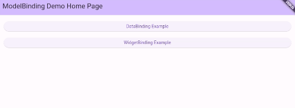
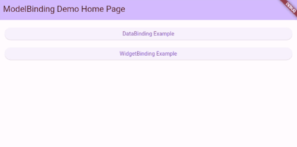

# ModelBinding

ModelBinding is a Widget data binding framework implemented using MapModel, and its biggest advantage is that modifying data can automatically refresh corresponding Widgets.

Unlike traditional mvvm frameworks, it does not require the establishment and maintenance of additional bundling relationships. Its core idea is "get and bundle" - which is more in line with data usage habits.

[MapModel](https://pub.flutter-io.cn/packages/map_model) is currently the most efficient model implementation framework, it uses Map to implement a model.

Map instances only need to determine the method of obtaining fields and control their visibility to obtain different models, such as Entity, VO, DTO, etc., instead of constantly opening up new memory space to move data, reducing unnecessary losses.

## Setup

```yaml
dependencies:
  model_binding: any
  ...

dev_dependencies:
  build_runner: any
  model_binding_builder: any
  ...
```

## Example

### model

provided `@Model` `@ModelBinding` annotation

[@Model]() can use for Map as Model, like Entity, Vo, Dto. see [MapModel](https://pub.flutter-io.cn/packages/map_model)

[@ModelBinding]() can use for Map to Binding flutter Widget, Implementing bidirectional binding.

That is to say, the interface for modifying values will be partially refreshed, the display of values at the reference point, and the control input will also change the new value and be notified.

```dart
import 'package:model_binding/model_binding.dart';

part 'your_model.g.dart';

@Model([
  Property<String?>('nullableString', value: '"123"'),
  Property<int>('fixInt'),
  Property('withValueConvert', value: '12', convert: 'convert'),
  Property<List<String?>?>('listWithType'),
  Property<List?>('listNoType'),
  Property<Map<String?, dynamic>?>('mapWithType'),
  Property<Map?>('mapNoType'),
])
class YourModel extends _YourModelImpl {

  YourModel([super.data]);
}

convert(data) => data.toString();


@ModelBinding([
  Property<String?>('nullableString', value: '"123"'),
  Property<int>('fixInt'),
  Property('withValueConvert', value: '12', convert: 'convert'),
  Property<List<String?>?>('listWithType'),
  Property<List?>('listNoType'),
  Property<Map<String?, dynamic>?>('mapWithType'),
  Property<Map?>('mapNoType'),
])
class YourBinding extends _YourBindingImpl {

  YourBinding([super.data]);
}

```

### use MapBinding & ListBinding

```dart
var mapBinding = MapBinding();
  mapBinding['a'] = 12;
  mapBinding['b'] = '34';
  mapBinding['c'] = [56, '78'];

  mapBinding['d'] = ListBinding<int>([90, 01]);// use generic
  mapBinding['e'] = MapBinding<String>({// use generic
    'f' : '23',
    'g' : '45',
  });

  // export offline data
  var export = mapBinding.export(includes: {'a','b', 'd', 'e'}, excludes: {'b'});
  var str = const JsonEncoder().convert(export);
  // console see '{"a":12,"d":[90,1],"e":{"f":"23","g":"45"}}'
  debugPrint(str);
```

### use ModelBinding



example provide 3 widget binding methods:
- `Raw Widget`: use flutter raw widget add parameter
```dart
/// controller and onChanged must be provided
TextField(
  controller: dataBinding.textField('nullableString'),// must be
  onChanged: (value) {// must be
      dataBinding.nullableString = value;
      setState(() {});
  },
);
```
- `Minimum Binding`: use Binding class, only refresh controller
```dart
/// use default context, that Binding class self context
TextFieldBinding(
  binding: dataBinding,
  property: 'nullableString',
);
```
- `Custom Binding`: use Binding class, specify context

```dart
/// use special context control refresh range
TextFieldBinding(
  binding: dataBinding,
  property: 'nullableString',
  context: context,
);
```

context in Binding class, can be partially refreshed.

### use WidgetBinding



```dart
@override
Widget build(BuildContext context) => Scaffold(
    appBar: AppBar(
      automaticallyImplyLeading: true,
      title: const Text('Widget binding'),
    ),
    body: Center(
      child: Column(
        children: [
          RefreshableBuilder(
            builder: (context) => Column(
              children: [
                RadioListTile<RefreshMode>(
                    title: const Text('self: only control rebuild'),
                    value: RefreshMode.self,
                    groupValue: mode,
                    onChanged: (value) {
                      mode = value!;
                      setState(() {});
                    }),
                RadioListTile<RefreshMode>(
                    title: const Text('partially: find RefreshableBuilder to rebuild'),
                    value: RefreshMode.partially,
                    groupValue: mode,
                    onChanged: (value) {
                      mode = value!;
                      setState(() {});
                    }),
                const Text(
                  'Both self and partially based on context arguments',
                  style: TextStyle(),
                ),
                const Divider(),
                Container(
                  margin: const EdgeInsets.symmetric(
                      horizontal: 20, vertical: 10),
                  child: TextFieldBinding(
                    binding: binding,
                    property: 'nullableString',
                    mode: mode,
                    //context: context, // base on from
                  ),
                ),
                Text('partially refresh point：${binding.nullableString ?? ''}'),
              ],
            ),
          ),
          ElevatedButton(
              onPressed: () {
                setState(() {});
              },
              child: const Text('refresh outside')),
          Text('outside refresh point：${binding.nullableString ?? ''}'),
        ],
      ),
    ),
);
```

- `RefreshableBuilder` is similar to InheritedWidget, mainly used to mark a local refresh point.
- `TextFieldBinding.mode`  `RefreshMode.self` only refresh control self; `RefreshMode.partially` base on context find RefreshableBuilder.
- `TextFieldBinding.context` <span style="color:yellow;">If the refresh range is too small, a higher-level context can be provided</span>


### Advanced
- `addListener` be called when value has Changed. need `dispose()` release. but not recommended.
- `RefreshableBuilder.of(context)` can get RefreshableBuilder instance.
- `RefreshableBuilder.rebuild(context)` can local refresh ui.
- `BindingSupport` use can mixin it to quick build binding.
- `BindingSupport.of(context)` can get State with BindingSupport instance.
- `Binding.of(context)` can get binding model instance. equivalent to `BindingSupport.of(context).bind`

`Binding. of (context)` used for cross level calls to widget trees

## Generate

```shell
flutter pub run build_runner build
```
or

```shell
dart run build_runner build
```

## ModelBinding vs Provider vs Get_it
The Provider framework provides excellent Consumer utility classes, but unfortunately, data binding requires the creation of a large number of Provider subclasses, such as ChangeNotifierProvider, ListenableProvider, ValueListenableProvider, StreamProvider, and so on. This mechanism is called state management, and although there are similar concepts in Vue and React, it is completely unnecessary for Flutter to establish such a mechanism because Flutter has a very complete context.

I think the main reason for the design of the Provider framework is the lack of a data binding layer, so you will find that when using the Provider, the page is quickly written, but you need to write about how to synchronize data fields outside of the page.

ModelBinding believes that when writing a widget tree, the structure of the page, the range of local refreshes, and the data they are bound to should be clearly known. This is like a declarative approach that exhausts the results, rather than implying an addListener (although ModelBinding also provides a way to add listeners, it is not recommended); Declarative programming also conforms to most people's writing habits; In addition, ModelBinding believes that establishing synchronization between multiple data items is not as good as having the same data referenced in multiple places. This is thanks to the use of the MapModel framework by ModelBinding, which is characterized by the Map being used as a model. Transforming a model only means that the visibility of the same Map is different, and the essence is still the same instance.

In addition, the ModelBinding binding layer also provides a more user-friendly toolbox, such as TextFieldBinding, which can be used as control input and output to bind data items in both directions.


Compared to the GetIT framework, firstly, GetIT is a wrapper class for data. When using it, the original data needs to be wrapped in GetIT, which is similar to the ref of vue3, but cannot be used as a recursive proxy like vue3, which will keep developers wrapping subitems. It can also package some widgets, but it is also the result of developers increasing their workload to continuously package and unpack them.

ModelBinding believes that it is not a very wise choice to hand over the details and workload to developers. Maybe it can be implemented in the underlying details, but it is unnecessary to expose it. This is not elegant, and it does not conform to the writing habits of most people. This is like 1+1. As far as possible, it should not be a.add (b). It should consider the operator overloading of the plus sign, and maintain the writing method of 1+1;

In fact, many details of the underlying ModelBinding also refer to the GetIT implementation, but the API we provide is more user-friendly. In addition, GetIT also needs to establish additional binding relationships like the provider. In the same sentence, no matter how much data is synchronized, it is never better to have the same data;